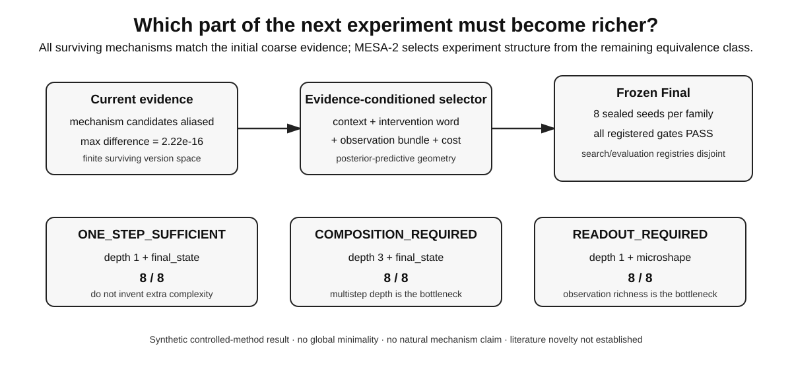

# Experiment-Structure Selection under Mechanism Equivalence

**Which part of the next experiment must become richer?**

**Hanyu Yu · MESA-2 synthetic controlled-method artifact**

Many experiment-design methods assume the kind of experiment in advance: choose an intervention target, a concentration, a sensor, or an input waveform. This project asks a different, higher-level question:

> **Given the mechanisms still compatible with current evidence, should the next separating experiment add intervention depth, richer observation, or simply a more complete one-step state measurement?**

MESA-2 treats an experiment as a structured program:

```text
context + intervention word + observation bundle + physical cost
```

and evaluates whether an evidence-conditioned selector can recover the correct *experiment structure* in controlled mechanism-equivalence problems.

<p align="center"></p>

## 30-second result

All candidate mechanisms in each frozen synthetic family match the initial coarse evidence to machine precision (`max alias = 2.22e-16`). The sealed Final uses eight untouched seeds (`2000–2007`) per family.

| Frozen family | What is actually missing? | First selected program in Final |
|---|---|---|
| `ONE_STEP_SUFFICIENT` | a complete one-step state measurement | depth 1 + `final_state`, **8/8** |
| `COMPOSITION_REQUIRED` | intervention composition | depth 3 + `final_state`, **8/8** |
| `READOUT_REQUIRED` | a richer observation interface | depth 1 + `microshape`, **8/8** |

The important negative controls are part of the result. In `ONE_STEP_SUFFICIENT`, restricting the policy to final-state observations is not meaningfully worse than the full grammar, so the method does not manufacture a need for richer readout. In `COMPOSITION_REQUIRED`, the full grammar beats the depth-1-only policy in all eight Final seeds (`p = 0.00390625`), while a final-state-only observation bundle remains sufficient once multistep programs are allowed. In `READOUT_REQUIRED`, the full grammar beats the final-state-only policy in all eight Final seeds (`p = 0.00390625`), and the first selected experiment is a one-step microshape readout rather than unnecessary extra intervention depth.

The formal frozen decision is:

```text
PASS_MESA2_GEOMETRY_SELECTS_EXPERIMENT_STRUCTURE
```

## What the selector sees

For each candidate experiment `e`, MESA-2 computes posterior-predictive covariance across the currently surviving mechanism version space after development-only scaling and block-noise whitening:

```text
g_e = Cov_w[mu_e(M)]
```

and ranks candidates by

```text
0.5 * log det(I + g_e) / incremental physical cost
```

The hidden target parameter and its Jacobian are **not** used to score candidates. Search and evaluation use disjoint contexts and disjoint intervention-word families.

## What is actually established

Within three engineered synthetic source families, the frozen policy distinguishes three different reasons that current mechanisms remain equivalent under existing evidence: insufficient one-step state measurement, insufficient intervention depth, or insufficient observation richness. The selected programs reduce mechanism uncertainty on held programs that were not available during search.

This is a **controlled method result**, not a claim that a machine invented a globally minimal physical experiment.

## Claim boundary

This artifact does **not** establish:

- global minimality of the selected experiments;
- natural or empirical mechanism identification;
- a universal experiment grammar;
- a universal mechanism geometry;
- surface-minimization mechanism recovery;
- literature novelty for informative experiment selection, equivalence-class refinement, distinguishing sequences, active input design, or sensor/readout selection.

See [`CLAIM_BOUNDARY.md`](CLAIM_BOUNDARY.md) and [`LITERATURE_BOUNDARY.md`](LITERATURE_BOUNDARY.md).

## Frozen evidence

The public checkout includes the independently audited Final summary and the source-facing protocol/claim card/build validation used to anchor the result:

```text
results/final_independent_audit.json
source/MESA2_PROTOCOL.md
source/MESA2_FINAL_CLAIM_CARD.md
source/MESA2_BUILD_VALIDATION.json
source/MESA2_ENGINEERING_HISTORY.md
```

The Final output package itself is hash-locked as:

```text
SHA-256  3cfe91830e72ae3dead4edb6ecdbd9d7befdbe779f77082e767628a58e425c25
```

The frozen runner-code composite hash is:

```text
SHA-256  aa8ca42b1dbae1aee113da984a512a5b7e1c66eaa7adff6d005f264d7ff3ecc7
```

## Reproducibility boundary

This v0.1 public artifact supports **audit-level reproduction of the frozen decision**: it verifies source hashes, manifest integrity, Final gates, the three selected first-program structures, and the declared comparison results.

It does **not** redistribute the original sealed runner or the full raw Final output package, so it is not a one-command clean-room regeneration of the synthetic experiment. That distinction is deliberate and is documented in [`REPRODUCIBILITY.md`](REPRODUCIBILITY.md).

Run the public verifier with:

```bash
python scripts/validate_artifact.py
```

## Why this belongs in the larger research program

The earlier mechanism-readability benchmarks ask which richer observation or intervention first restores distinguishability after easy information shortcuts are removed. MESA-2 moves one level upward: instead of manually choosing the next diagnostic interface, it asks whether the *structure of the next experiment* can be selected from the current surviving mechanism equivalence class.
